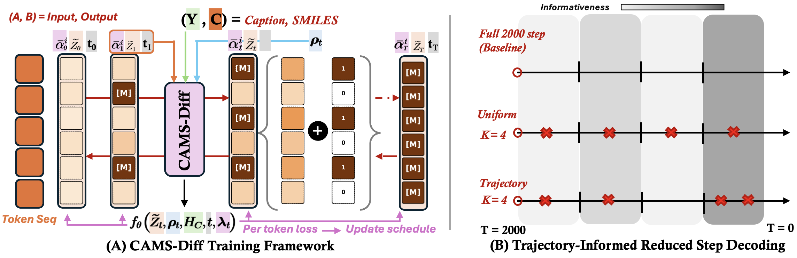

# CAMS-Diff

**Coupled Adaptive Mixed-Space Diffusion for Molecular Translation**

*Anonymous authors · Under review at ICLR 2027*

<p align="center">
  
</p>

<p align="center">
  <sub><b>(A) Training.</b> Continuous diffusion is coupled to discrete representation masking through one token-wise adaptive noise schedule; per-token loss feeds back into the schedule, which recalibrates both corruption modes together. <b>(B) Inference.</b> Trajectory informativeness allocates a reduced budget of <code>K</code> reverse steps non-uniformly across the <code>T = 2000</code> denoising trajectory.</sub>
</p>

> Please raise questions in the OpenReview thread rather than here, to preserve double-blind review.

---

## Overview

Molecular translation covers molecule captioning, text-guided generation, forward reaction prediction, and retrosynthesis. Continuous sequence diffusion gives all four a common conditional denoising formulation over SMILES and text. Two questions remain underexplored in that formulation: how corruption should vary across token positions during training, and where denoising steps should fall along the reverse trajectory at inference. CAMS-Diff addresses one at each end.

**L1 — Local token recoverability can reduce reliance on sequence context and conditioning.** At low noise levels a continuous representation may retain substantial information about the underlying discrete token, letting the denoiser reconstruct a position with limited reliance on the surrounding sequence or on the conditioning input. That local recovery shortcut is undesirable for SMILES, where correct reconstruction can depend on non-local dependencies such as ring closures and nested branches. Token-wise adaptive noising changes *how strongly* individual positions are corrupted, but does not explicitly remove the locally available evidence; masking and absorbing-state corruption remove it directly in text diffusion, but the interaction between discrete masking and token-wise adaptive continuous corruption has not been examined.

**L2 — Reduced-step sampling is sensitive to *where* evaluations are kept.** Inference needs many sequential denoiser calls, so deployment depends on cutting the 2000-step reverse trajectory to a handful. Uniform subsampling is the common choice, and quality degrades under it — evidence that the loss comes from which steps are discarded rather than from using fewer steps alone. Trajectory-informed placement under a fixed budget remains unexplored for molecular translation.

Both are answered with the same principle: **let the learned denoising dynamics decide.** They govern corruption during training, and timestep selection at inference.

---

## Method

### 1. Coupled adaptive mixed-space diffusion (training)

Gaussian diffusion evolves a continuous latent while a discrete mask variable decides whether each position is observed or replaced by a learned mask representation `m`. Masking removes the direct local evidence and pushes reconstruction back onto the remaining sequence and the conditioning input. The point is not that the two corruption modes are mixed — that has precedent in text diffusion — but that they are **coupled to one schedule**.

The masking probability is read directly off the learned token-wise Gaussian corruption coefficient:

```
ρᵢₜ ~ Bernoulli(ϖᵢₜ),    ϖᵢₜ = 0            for t = 1
                          ϖᵢₜ = η · βᵢₜ      for t = 2 … T

z̃ᵢₜ = (1 − ρᵢₜ) · zᵢₜ + ρᵢₜ · m
```

where `η` controls masking strength, `η = 0.5` by default. Recalibrating `βᵢₜ` therefore recalibrates `ϖᵢₜ` with it: positions the model finds hard to denoise receive both stronger Gaussian corruption and a higher chance of having their local evidence removed. Where the projected schedule plateaus, `βᵢₜ = 0`, so masking and denoising weight both vanish at that position–timestep pair.

Because the same masking law appears in both the forward and generative factorizations, its probability terms cancel in the variational ratio. The Gaussian posterior and the token-wise SNR weights `wᵢₜ = ½(SNRᵢₜ₋₁ − SNRᵢₜ)` are unchanged, and the objective keeps its usual form with the clean-state prediction formed from the mixed observation. Since boundary noise levels are shared across positions, every position receives the same total SNR-drop weight — the token-wise schedule redistributes denoising weight along the trajectory rather than changing its total amount.

### 2. Trajectory-informed reduced-step decoding (inference)

After training, the full `T`-step reverse process is run once on the validation set. For each position, mean clean-state reconstruction error is paired with its token-wise log-SNR and fitted as a smooth curve `Eᵢ(λ)`. Skipping an interval between two retained SNR levels costs approximately `½ aᵢ(λ)(Δλ)²`, with

```
aᵢ(λ) = [ −e^λ · dEᵢ(λ)/dλ ]₊
```

**Proposition 1.** The position-wise allocation minimizing this reconstruction-based approximation error satisfies `p*ᵢ(λ) ∝ √aᵢ(λ)`.

Reverse diffusion uses one shared timestep per denoiser call, so position-wise contributions are mapped onto the common timestep axis and aggregated into a single profile `p(t)`, discretized into roughly `2K` bins. The `K − 1` highest-mass interior bins are kept and represented by their `p(t)`-weighted centers, giving `T = J₀ > J₁ > … > J_K = 0`.

The schedule is built **once, offline**, from validation trajectories and reused unchanged at test time. The trained model and the reverse update rule are untouched, so it composes with DDIM, DPM-Solver++, or any compatible reduced-step sampler.

---

## Results

CAMS-Diff is evaluated across five settings: molecule captioning, text-guided generation, forward reaction prediction, retrosynthesis, and zero-shot transfer. Full-step inference uses `T = 2000`.

Across these settings it improves molecular and semantic recovery over autoregressive, sequence-diffusion, and graph-diffusion baselines, at a comparable or smaller parameter count, and transfers to an unseen generation benchmark without task-specific fine-tuning. Controlled ablations isolate both mechanisms: coupling the two corruption modes to one schedule improves over adaptive noising alone, masking alone, and their uncoupled combination, while trajectory-informed timestep selection improves over uniform subsampling at matched budgets — same checkpoint, same sampler, same number of denoiser evaluations. Two-step captioning reaches quality comparable to full-step BiMol-Diff using two denoiser evaluations instead of 2000, an approximately 245× wall-clock speedup under matched single-A100 timing. Gains widen as instructions and target sequences get longer.

Per-metric numbers, baselines, and the full ablation breakdown are in the paper.

**Known limitation.** SMILES validity trails the strongest graph-diffusion baseline. The residual errors are overwhelmingly *serialization* failures rather than chemistry — unpaired ring labels, unclosed branches, and extra closing parentheses dominate, while invalid atomic valence is rare. This motivates future corruption that treats coupled SMILES constraints as structured units rather than independently corrupted positions.

---

## Repository layout

```
captioning/                      # molecule captioning, 63M configuration
  cams_captioning/               # diffusion core, denoiser, rounding, schedule utils
  scripts/                       # train / decode / eval / benchmark entry points
  sample_seq2seq.py              # full-step sampling
  sample_seq2seq_dpmSolver.py    # reduced-step sampling

generation/                      # molecular-output tasks, 180M configuration
  cams_generation/
    cams_generation/
      gaussian_diffusion.py      # token-wise schedule + coupled masking
      dpm_solver.py              # token-adaptive DPM-Solver++
      transformer_model2.py      # SciBERT-conditioned denoiser
    scripts/
      reduced_step_profile.py    # validation trajectory profiling
      trajectory_analysis.py     # importance curves in log-SNR space
      build_retro_dataset.py     # reaction data preparation
  build_custom_step_matrix.py    # uniform-schedule control for matched-budget runs
  pcdes_zero_shot.py             # zero-shot transfer evaluation
  scalability_analysis.py
  tests/
  transformers/                  # vendored fork

assets/                          # figures
```

Two model configurations are used: a 63M encoder–decoder for captioning (6 encoder / 9 decoder layers, 128-d latent), and a 180M configuration for all molecular-output tasks (frozen SciBERT condition encoder, 12-layer Transformer denoiser, 32-d latent, 256 max length). The three molecular-output tasks are trained as separate task-specific checkpoints on the same architecture. Padding positions are excluded from token-level losses and from the position-wise trajectory statistics used for reduced-step allocation.

---

## Datasets

| Dataset | Task | Split | Size |
|---|---|---|---|
| M3-20M | Captioning | 80 / 10 / 10 | ~300K |
| ChEBI-20 | Text → molecule | UTGDiff protocol | 26,407 / 3,301 / 3,300 |
| Mol-Instructions | Forward reaction | UTGDiff + holdout | ~110K / 10K / 1K |
| Mol-Instructions | Retrosynthesis | UTGDiff + holdout | ~110K / 10K / 1K |
| PCDes | Zero-shot generation | standard | 10,500 / 1,500 / 3,000 |

ChEBI-20 and both reaction splits follow the UTGDiff protocol so the comparisons share a benchmark setup. For the reaction tasks, the 10K validation examples are held out from the original training partition and used for validation and trajectory-based schedule construction; test sets are never used during schedule construction. PCDes is used only for zero-shot evaluation and never updates model parameters.
