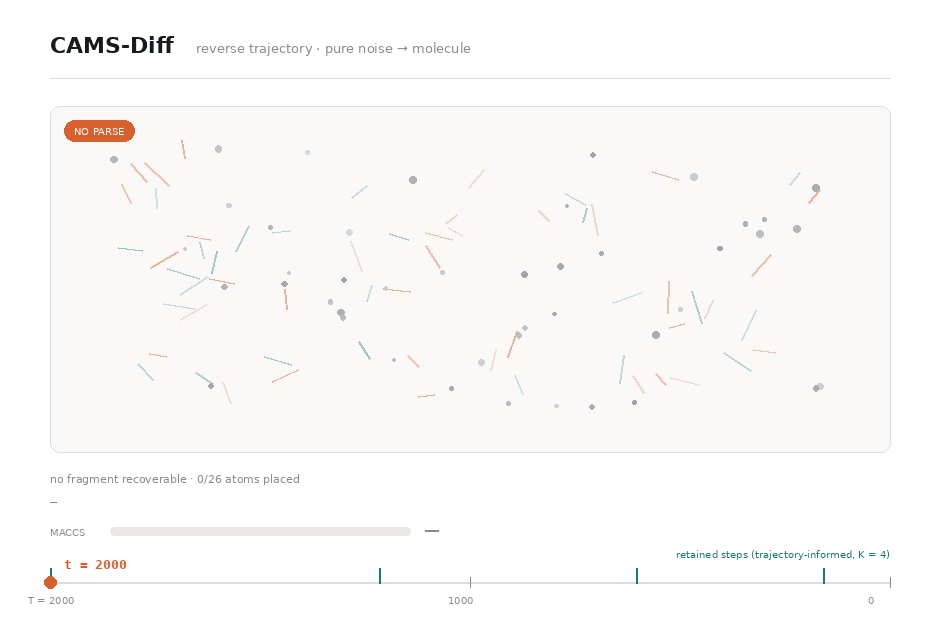

# CAMS-Diff

**Coupled Adaptive Mixed-Space Diffusion for Molecular Translation**

*Anonymous authors · Under review at ICLR 2027*

<p align="center">
  
</p>

<p align="center">
  <sub><b>(A) Training.</b> Continuous diffusion is coupled to discrete representation masking through one token-wise adaptive noise schedule; per-token loss feeds back into the schedule, which recalibrates both corruption modes together. <b>(B) Inference.</b> Trajectory informativeness allocates a reduced budget of <code>K</code> reverse steps non-uniformly across the <code>T = 2000</code> denoising trajectory.</sub>
</p>

<p align="center">
  
</p>

<p align="center">
  <sub>The reverse trajectory. Left: the token-wise latent under Gaussian corruption with coupled representation masking. Right: the SMILES readout decoded from the predicted clean latent, resolving from an unparsable fragment through an open ring closure to an exact match. Bottom: the <code>K = 4</code> retained timesteps selected by trajectory importance. Schematic illustration of the mechanism, not a logged sampler run.</sub>
</p>

---

## Status of this release

This repository accompanies the submission as a **reference for the method**, not as a runnable release. It contains the model and diffusion source so reviewers can inspect how the two contributions are implemented, but training configurations, data preparation, checkpoints, and a verified end-to-end pipeline are **not** included, and the code should not be expected to run as-is. The complete release will follow on acceptance.

Please raise questions in the OpenReview thread rather than here, to preserve double-blind review.

---

## Overview

Molecular translation covers molecule captioning, text-guided generation, forward reaction prediction, and retrosynthesis. Continuous sequence diffusion gives all four a common conditional denoising formulation over SMILES and text. Two problems remain open in that formulation; CAMS-Diff addresses one at training time and one at inference time.

**L1 — Continuous corruption leaves low-noise tokens locally recoverable.** At low noise levels a continuous latent still carries substantial information about the underlying discrete token, so the denoiser can read a token off its own position instead of reconstructing it from context. That matters for SMILES in particular, where correctness depends on non-local structure: ring-closure digits, nested branches, matched parentheses.

**L2 — Reduced-step sampling is sensitive to *where* evaluations are kept.** Deployment needs the 2000-step reverse trajectory cut to a handful of denoiser calls. Uniform subsampling is the default, and quality degrades under it — not because fewer steps are used, but because informative regions of a non-uniform trajectory get skipped.

Both are answered with the same principle: **let the learned denoising dynamics decide.** They govern corruption during training, and timestep selection at inference.

---

## Method

### 1. Coupled adaptive mixed-space diffusion (training)

Gaussian diffusion evolves a continuous latent while a discrete mask variable decides whether each position is observed or replaced by a learned mask representation `m`. The point is not that the two corruption modes are mixed — that has precedent in text diffusion — but that they are **coupled to one schedule**.

The masking probability is read directly off the learned token-wise Gaussian corruption coefficient:

```
ρᵢₜ ~ Bernoulli(ϖᵢₜ),    ϖᵢₜ = 0            for t = 1
                          ϖᵢₜ = η · βᵢₜ      for t = 2 … T

z̃ᵢₜ = (1 − ρᵢₜ) · zᵢₜ + ρᵢₜ · m
```

with `η = 0.5` by default. Recalibrating `βᵢₜ` therefore recalibrates the masking process with it: positions the model finds hard to denoise receive both stronger Gaussian corruption and a higher chance of having their local evidence removed. Where the projected schedule plateaus, `βᵢₜ = 0`, so masking and denoising weight both vanish at that position–timestep pair.

Because the same masking law appears in both the forward and generative factorizations, its probability terms cancel in the variational ratio. The Gaussian posterior and the token-wise SNR weights `wᵢₜ = ½(SNRᵢₜ₋₁ − SNRᵢₜ)` are unchanged, and the objective keeps its usual form with the clean-state prediction formed from the mixed observation. Since boundary noise levels are shared across positions, every position receives the same total SNR-drop weight — the token-wise schedule changes *where* that weight sits along the trajectory, not how much of it there is.

### 2. Trajectory-informed reduced-step decoding (inference)

After training, the full `T`-step reverse process is run once on the validation set. For each position, mean clean-state reconstruction error is paired with its token-wise log-SNR and fitted as a smooth curve `Eᵢ(λ)`. Skipping an interval between two retained SNR levels costs approximately `½ aᵢ(λ)(Δλ)²`, with

```
aᵢ(λ) = [ −e^λ · dEᵢ(λ)/dλ ]₊
```

**Proposition 1.** The position-wise allocation minimizing this reconstruction-based approximation error satisfies `p*ᵢ(λ) ∝ √aᵢ(λ)`.

Reverse diffusion uses one shared timestep per denoiser call, so position-wise contributions are mapped onto the common timestep axis and aggregated into a single profile `p(t)`, discretized into roughly `2K` bins. The `K − 1` highest-mass interior bins are kept and represented by their `p(t)`-weighted centers, giving `T = J₀ > J₁ > … > J_K = 0`.

The schedule is built **once, offline**, from validation trajectories and reused unchanged at test time. The trained model and the reverse update rule are untouched, so it composes with DDIM, DPM-Solver++, or any compatible reduced-step sampler.

---

## Results

Full-step inference uses `T = 2000`. Reproduced baselines are marked; where multiple runs exist, results are mean ± std over three seeds.

### Molecule captioning — M3-20M

| Metric | Text+Chem T5 | DiffuSeq | TGM-DLM | BiMol-Diff | BiMol-Diff† | **CAMS-Diff** |
|---|---|---|---|---|---|---|
| #P | 223M | 91M | 125M | 63M | 63M | **63M** |
| BLEU ↑ | 0.542 | 0.532 | 0.467 | 0.567 | 0.557 | **0.610** |
| chrF++ ↑ | 0.701 | 0.708 | 0.689 | **0.734** | 0.710 | 0.705 |
| METEOR ↑ | 0.648 | 0.601 | 0.589 | 0.626 | 0.632 | **0.740** |
| BERTScore-F1 ↑ | 0.728 | 0.812 | 0.779 | 0.843 | 0.838 | **0.861** |
| MAUVE ↑ | 0.866 | 0.887 | 0.856 | 0.925 | 0.913 | **0.927** |

### Text-guided generation — ChEBI-20

| Metric | MolT5-Large | 3M-Diffusion | UTGDiff† | BiMol-Diff⋆ | TGM-DLM | **CAMS-Diff** |
|---|---|---|---|---|---|---|
| MACCS ↑ | 0.834 | 0.557 | 0.867 | 0.883 | 0.854 | **0.916** |
| RDK ↑ | 0.746 | 0.380 | 0.763 | 0.785 | 0.739 | **0.811** |
| Morgan ↑ | 0.684 | 0.302 | 0.695 | 0.758 | 0.688 | **0.790** |
| BLEU ↑ | **0.854** | 0.507 | 0.817 | 0.820 | 0.826 | 0.832 |
| Exact ↑ | **0.311** | 0.003 | 0.227 | 0.252 | 0.242 | 0.232 |
| Valid ↑ | **0.905** | 0.595 | 0.856 | 0.872 | 0.871 | 0.748 |

`UTGDiff†` is the non-pretrained setting, for a controlled comparison with CAMS-Diff, which also uses no molecular pretraining.

### Reaction prediction — Mol-Instructions

| Model | Retro. Exact ↑ | Retro. MACCS ↑ | Retro. Morgan ↑ | Fwd. Exact ↑ | Fwd. MACCS ↑ | Fwd. Morgan ↑ |
|---|---|---|---|---|---|---|
| InstructMol-GS (6.9B) | 0.407 | 0.852 | 0.714 | 0.407 | 0.878 | 0.741 |
| BioT5 (252M) | 0.480 | 0.904 | 0.810 | 0.684 | 0.954 | 0.890 |
| UTGDiff* (125M) | 0.462 | 0.891 | 0.789 | 0.828 | 0.978 | 0.948 |
| **CAMS-Diff (180M)** | **0.541** | **0.931** | **0.873** | **0.830** | **0.985** | **0.967** |

### Zero-shot transfer — PCDes

The ChEBI-20-trained generation model applied directly to PCDes, with no task-specific fine-tuning.

| Metric | MolT5-base | BioT5-base | TGM-DLM | 3M-Diffusion | UTGDiff | **CAMS-Diff** |
|---|---|---|---|---|---|---|
| MACCS ↑ | 0.733 | 0.737 | 0.741 | 0.495 | 0.763 | **0.810** |
| RDK ↑ | 0.651 | 0.646 | 0.667 | 0.332 | 0.675 | **0.746** |
| Morgan ↑ | 0.621 | 0.595 | 0.612 | 0.242 | 0.623 | **0.733** |
| Exact ↑ | 0.204 | 0.242 | 0.221 | 0.015 | 0.386 | **0.427** |

---

## Ablations

Both mechanisms are isolated under matched conditions.

**Coupling (L1).** Masking and adaptive noising each help on their own; combining them helps more; coupling them to one schedule helps most.

| Variant | Cap. BLEU ↑ | Cap. BERT-F1 ↑ | Gen. MACCS ↑ | Gen. Morgan ↑ |
|---|---|---|---|---|
| Uniform | 0.523 | 0.780 | 0.874 | 0.722 |
| + Mixed space | 0.546 | 0.810 | 0.870 | 0.748 |
| + Adaptive noising | 0.560 | 0.830 | 0.889 | 0.750 |
| Uncoupled | 0.597 | 0.841 | 0.909 | 0.768 |
| **Coupled (CAMS-Diff)** | **0.610** | **0.861** | **0.916** | **0.790** |

The uncoupled variant uses adaptive noising with a *fixed* masking probability matched to CAMS-Diff's overall masking rate but independent of `βᵢₜ`. The gap between the last two rows is the contribution of coupling itself. Performance varies smoothly with `η`, and the default `η = 0.5` sits in the strongest MACCS region across generation and both reaction directions.

**Step allocation (L2).** At matched budgets — same checkpoint, same sampler, same number of denoiser evaluations — trajectory-informed placement beats uniform subsampling by up to 1.81 MACCS points on generation, and 1.90 / 2.70 validity points on retrosynthesis with DPM-Solver++ / DDIM. Early-, middle-, and late-biased controls show that no fixed region of the reverse trajectory reproduces it; the useful region depends on the budget. At `K = 1` the two schedules necessarily coincide, since there is no allocation freedom.

**Two-step captioning.** `K = 2` reaches 56.8 BLEU against 55.7 for reproduced full-step BiMol-Diff — two denoiser evaluations instead of 2000, ≈245× wall-clock speedup under matched single-A100 timing.

**Difficulty scaling.** Gains widen as generation gets harder. Exact match improves over the strongest baseline by 13.7 / 16.3 / 20.4 points across the 65–96, 97–128, and 129–160 instruction-length bins. In the longest-sequence regime, reaction exact match is 0.73 vs 0.56 for forward prediction and 0.51 vs 0.33 for retrosynthesis.

**Known limitation.** Validity trails UTGDiff (0.748 vs 0.856). The residual errors are overwhelmingly *serialization* failures rather than chemistry: unpaired ring labels (43.95%), unclosed branches (41.35%), extra closing parentheses (37.86%), against only 4.87% invalid atomic valence — categories are non-exclusive. This motivates future corruption that treats coupled SMILES constraints as structured units rather than independently corrupted positions.

---

## Repository layout

```
captioning/                      # molecule captioning, 63M configuration
  cams_captioning/               # diffusion core, denoiser, rounding, schedule utils
  scripts/                       # train / decode / eval / benchmark entry points
  sample_seq2seq.py              # full-step sampling
  sample_seq2seq_dpmSolver.py    # reduced-step sampling

generation/                      # molecular-output tasks, 180M configuration
  cams_generation/
    cams_generation/
      gaussian_diffusion.py      # token-wise schedule + coupled masking
      dpm_solver.py              # token-adaptive DPM-Solver++
      transformer_model2.py      # SciBERT-conditioned denoiser
    scripts/
      reduced_step_profile.py    # validation trajectory profiling
      trajectory_analysis.py     # importance curves in log-SNR space
      build_retro_dataset.py     # reaction data preparation
  build_custom_step_matrix.py    # uniform-schedule control for matched-budget runs
  pcdes_zero_shot.py             # zero-shot transfer evaluation
  scalability_analysis.py
  tests/
  transformers/                  # vendored fork

assets/                          # figures
```

Two model configurations are used: a 63M encoder–decoder for captioning (6 encoder / 9 decoder layers, 128-d latent), and a 180M configuration for all molecular-output tasks (frozen SciBERT condition encoder, 12-layer Transformer denoiser, 32-d latent, 256 max length). The three molecular-output tasks are trained as separate task-specific checkpoints on the same architecture. Padding positions are excluded from token-level losses and from the position-wise trajectory statistics used for reduced-step allocation.

---

## Datasets

| Dataset | Task | Split | Size |
|---|---|---|---|
| M3-20M | Captioning | 80 / 10 / 10 | ~300K |
| ChEBI-20 | Text → molecule | UTGDiff protocol | 26,407 / 3,301 / 3,300 |
| Mol-Instructions | Forward reaction | UTGDiff + holdout | ~110K / 10K / 1K |
| Mol-Instructions | Retrosynthesis | UTGDiff + holdout | ~110K / 10K / 1K |
| PCDes | Zero-shot generation | standard | 10,500 / 1,500 / 3,000 |

ChEBI-20 and both reaction splits follow the UTGDiff protocol so the comparisons share a benchmark setup. For the reaction tasks, the 10K validation examples are held out from the original training partition and used for validation and trajectory-based schedule construction; test sets are never used during schedule construction. PCDes is used only for zero-shot evaluation and never updates model parameters.

---

## Citation

```bibtex
@inproceedings{camsdiff2027,
  title     = {{CAMS-Diff}: Coupled Adaptive Mixed-Space Diffusion for Molecular Translation},
  author    = {Anonymous},
  booktitle = {Submitted to the International Conference on Learning Representations},
  year      = {2027},
  note      = {Under review}
}
```

## Acknowledgements

Builds on the continuous sequence-diffusion line of work — Diffusion-LM, DiffuSeq, SeqDiffuSeq, TGM-DLM, and BiMol-Diff — and is evaluated against UTGDiff, BioT5+, and related molecular translation baselines. `generation/transformers/` vendors a fork of HuggingFace Transformers.
